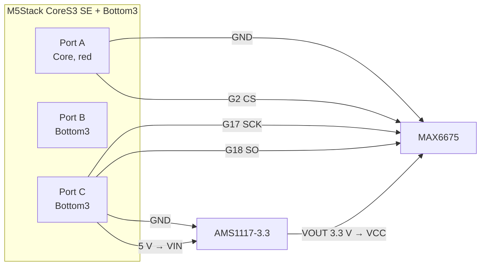

# Meatometer

See the [docs](https://docs.espressif.com/projects/esp-matter/en/latest/esp32/developing.html) by Espressif for more information about building and flashing the firmware.

## Pin mapping (CoreS3 SE + M5GO Battery Bottom3)

Grove/HY2.0-4P wire order is always **black / red / yellow / white** = GND / 5 V / GPIO / GPIO.

**Port A** is the **red** HY2.0 on the **CoreS3 SE** (USB-C side).
Bottom3 brings out **Port B** and **Port C**.
Do not feed MAX6675 **VCC** from Grove 5 V; use the AMS1117 **3.3 V** output.
Firmware turns Grove/M-Bus 5 V on at boot (`BOOST_EN` + `BUS_OUT_EN`).

The Bottom3 **WS2812** ring is wired on the M5-Bus (`G5`).

| Connector          | Signal      | GPIO | NTC 1        | NTC 2        | MAX6675   | AMS1117 | WS2812    |
| ------------------ | ----------- | ---- | ------------ | ------------ | --------- | ------- | --------- |
| Port A (Core, red) | GND (black) |      |              |              | GND       | GND     |           |
| Port A (Core, red) | 5 V (red)   |      |              |              |           |         |           |
| Port A (Core, red) | yellow      | G2   |              |              | CS        |         |           |
| Port A (Core, red) | white       | G1   |              |              |           |         |           |
| Port B (Bottom3)   | GND (black) |      | GND          | GND          |           |         |           |
| Port B (Bottom3)   | 5 V (red)   |      |              |              |           |         |           |
| Port B (Bottom3)   | yellow      | G9   |              | divider tap  |           |         |           |
| Port B (Bottom3)   | white       | G8   | divider tap  |              |           |         |           |
| Port C (Bottom3)   | GND (black) |      |              |              |           |         |           |
| Port C (Bottom3)   | 5 V (red)   |      |              |              |           | VIN     |           |
| Port C (Bottom3)   | yellow      | G17  |              |              | SCK       |         |           |
| Port C (Bottom3)   | white       | G18  |              |              | SO (MISO) |         |           |
| M5-Bus (Bottom3)   | RGB         | G5   |              |              |           |         | DIN (10×) |
| AMS1117            | VOUT 3.3 V  |      | 10 kΩ to tap | 10 kΩ to tap | VCC       |         |           |

Each NTC (ThermoWorks TX-1001X-OP) is a 10 kΩ@25 °C thermistor from the divider tap to GND, with a 10 kΩ 1 % resistor from AMS1117 3.3 V to the same tap.

Firmware currently samples the UI-3 button on **G8** (`hmi.cpp`). Until that moves to **G1**, do not wire NTC 1 and the button to the same pin.

## 1. Additional Environment Setup

No additional setup is required.

## 2. Post Commissioning Setup

No additional setup is required.

## 3. Device Performance

### 3.1 Memory usage

The following is the Memory and Flash Usage.

-   `Bootup` == Device just finished booting up. Device is not
    commissionined or connected to wifi yet.
-   `After Commissioning` == Device is connected to wifi and is also
    commissioned and is rebooted.
-   device used: esp32c3_devkit_m
-   tested on:
    [6a244a7](https://github.com/espressif/esp-matter/commit/6a244a7b1e5c70b0aa1bf57254f19718b0755d95)
    (2022-06-16)

|                          | Bootup | After Commissioning |
| :----------------------- | :----: | :-----------------: |
| **Free Internal Memory** | 108KB  |        105KB        |

**Flash Usage**: Firmware binary size: 1.26MB

This should give you a good idea about the amount of free memory that is
available for you to run your application's code.

Applications that do not require BLE post commissioning, can disable it using app_ble_disable() once commissioning is complete.
